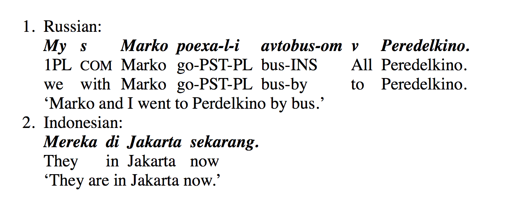

# Glosser

A [jQuery](https://jquery.com/) plugin for [linguistic glossing](https://en.wikipedia.org/wiki/Gloss_(annotation)).



## Installation

You can use [Bower](http://bower.io/) to install Glosser, by running the following command. 

```sh
bower install glosser
```

Or you can **[download](https://github.com/icod/glosser/releases/latest)** and unpack the [latest release](https://github.com/icod/glosser/releases/latest) of Glosser.

Include a link to Glosser’s CSS file like so:

```html
<link rel="stylesheet" href="path/to/glosser.css">
```

Make sure to include the JavaScript file *after* the jQuery reference. 

```html
<script src="path/to/jquery.min.js"></script>
<script src="path/to/glosser.js"></script>
```

## Basic usage

Simply create an HTML element like a `span` or `div` and give it a meaningful class name, like `.to-gloss`. 

```html
<div class="to-gloss">
	Dit is een testzin. Het werkt!
	This is a {test sentence} It work.3sg
</div>
```

Every line will be a glossed line. Every word on each line will be intrepreted as a separate gloss, divided by spaces. To have a gloss consist of multiple words (i.e. contain a space), place the intended gloss between curly brackets `{}`.

Next, use this simple JavaScript line to select the container and call the Glosser function. 

```js
$('.to-gloss').glosser();
```

And we’re done!